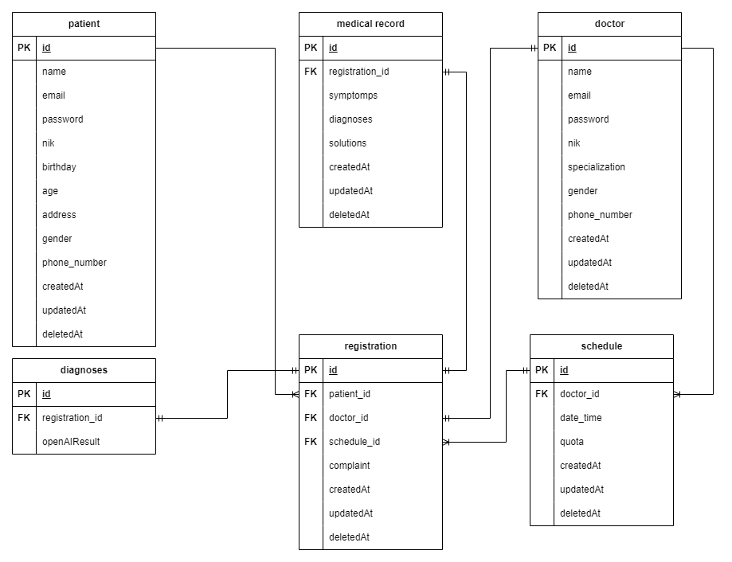

MINI PROJECT MOHAMMAD ARIEF LAZUARDI
100% Mastering Golang Programming
Golang C

# Clinic AI - API

The purpose of this application is to simplify the process of registering patients into the clinic and provide initial advice on the steps to be taken based on the complaints submitted by the patient. By using AI technology, this application can combine patient complaint data with medical knowledge available online, such as through OpenAI, to provide better recommendations to patients.

## Features

### 1. Patient

- Patient Registration and Login.
- Clinic Registration and Patient Complaint Input.
- Diagnosis Search Using Open AI based on patient complaints.
- Viewing Medical Records.

### 2. Doctor

- Doctor Registration and Login.
- View Registration.
- Create, View, Edit, and Delete Schedules.
- Create, View, Edit, and Delete Patient Medical Records.

## Tech Stack

- [Echo](https://echo.labstack.com/): Web Framework
- [Gorm](https://gorm.io/): Golang ORM
- [MySQL](https://www.mysql.com/): Relational Database
- [Docker](https://www.docker.com/): Containerization
- [GCP](https://cloud.google.com//): Cloud Platform Deployment
- Clean Architecture: Code Structure
- [Git](https://git-scm.com/): Version Control
- [JWT](https://jwt.io/): Authentication
- [AI](https://platform.openai.com/playground): AI Recommendation

## Installation

- Clone a Repository

```bash
git clone https://github.com/hafidznaufl/echo-gorm-boilerplate.git && cd echo-gorm-boilerplate
```

- Get & Install All Dependencies

```bash
go mod tidy
```

## File Environment `.env.example`

The `.env.example` file is an example configuration file used in this project. It contains a list of environment variables that must be set in the actual `.env` file to run the project correctly. Please copy this file as a reference to set the appropriate environment variables.

### Required Environment Variables

Here is the list of environment variables required in the file`.env`:

1. **DB_USER**: The database user name.
2. **DB_PASS**: Database user password.
3. **DB_HOST**: The database host.
4. **DB_PORT**: Port database.
5. **DB_NAME**: The name of the database used.
6. **SECRET_KEY**: Secret key for JWT Middleware
7. **SALT**: Salt for hashing passwords
8. **OPENAI_KEY**: OPEN AI KEY for diagnostics with OpenAI

### How to use `.env.example`

- Duplicate the `.env.example` file as `.env` and create it automatically if it is not already available

  ``bash
  cp -n .env.example .env

  ```

  ```

- Fill in the environment variable values in `.env` with your own environment

## ERD


[View Full ERD](https://drive.google.com/file/d/1DqCH-WJ7pB8S69n08bwxjbLXrfasAx0Y/view?usp=sharing)

## API Documentation

Explore Clinic AI API using our [Postman Documentation](https://documenter.getpostman.com/view/24198072/2s9YXb95bM).
